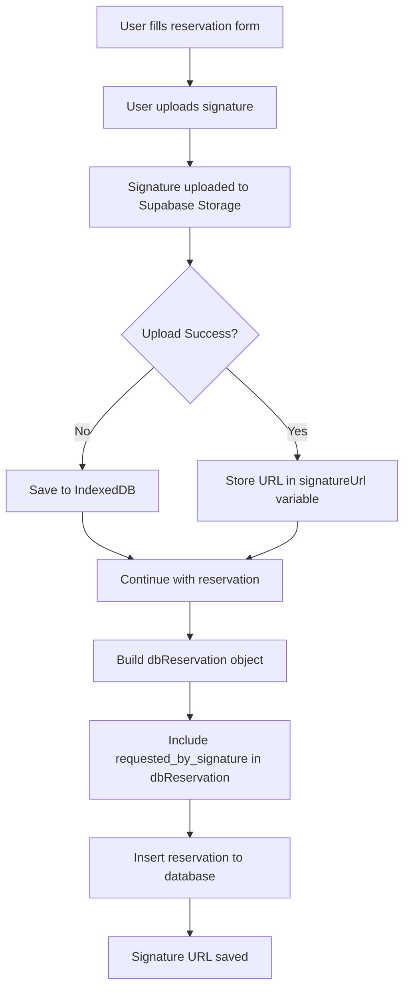

# Plan: Add Signature Column to Reservations Table

## Problem Analysis

The signature feature in `User panel/VRF.html` allows users to upload an e-signature image via drag-and-drop or file picker. However:

1. The signature is uploaded to Supabase Storage at `Reserved Facilities/signature_${codeId}.${fileExt}`
2. The `dbReservation` object (lines 1208-1222 in VRF.js) that gets inserted **does NOT include any signature field**
3. The Slip pages in Admin/SuperAdmin panels expect `requested_by_signature` field which doesn't exist in the database

### Current dbReservation Structure
```javascript
const dbReservation = {
    id: localStorage.getItem('user_id'),
    request_id: codeId,
    facility: selectedFacilities.join(", "),
    date: dateOfEventVal,
    time_start: timeStartInput.value,
    time_end: timeEndInput.value,
    title_of_the_event: eventTitle,
    unit: unitOffice || '',
    attendees: attendees || '',
    additional_req: additionalReq || '',
    set_up_details: setupDetails || '',
    pdf_url: '',
    status: 'request'
};
```

### Missing: `requested_by_signature` field

---

## Solution

### Step 1: SQL Migration - Add Column to Reservations Table

```sql
-- Add the signature column to reservations table
ALTER TABLE reservations 
ADD COLUMN IF NOT EXISTS requested_by_signature TEXT;

-- Add index for faster lookups
CREATE INDEX IF NOT EXISTS idx_reservations_signature 
ON reservations(requested_by_signature);

COMMENT ON COLUMN reservations.requested_by_signature 
IS 'URL to the e-signature image stored in Supabase Storage';
```

### Step 2: Update VRF.js - Include Signature URL in dbReservation

**Location**: `User panel/Javascript/VRF.js` around lines 1285-1303

**Current Code** (after successful upload):
```javascript
const uploadResult = await uploadToSupabase(file, filePath);

if (!uploadResult) {
    // Save to IndexedDB on failure
    const signatureKey = `${codeId}_signature`;
    await storeFileInIDB(signatureKey, file);
    reservation.signatureKey = signatureKey;
    reservation.signatureName = fileName;
}
```

**Problem**: When `uploadResult` is truthy (success), the signature URL is NOT saved to the database.

**Required Change**: After successful upload, store the file path in a variable and include it in `dbReservation`.

```javascript
// Track signature URL for database
let signatureUrl = '';

// ... upload code ...

if (file) {
    const fileExt = file.name.split('.').pop();
    const fileName = `signature_${codeId}.${fileExt}`;
    const filePath = `Reserved Facilities/${fileName}`;
    
    const uploadResult = await uploadToSupabase(file, filePath);

    if (uploadResult) {
        // Success - store the public URL
        signatureUrl = filePath; // or construct full public URL
    } else {
        // Upload failed - save to IndexedDB
        const signatureKey = `${codeId}_signature`;
        await storeFileInIDB(signatureKey, file);
        reservation.signatureKey = signatureKey;
        reservation.signatureName = fileName;
    }
}

// When building dbReservation (around line 1208)
const dbReservation = {
    id: localStorage.getItem('user_id'),
    request_id: codeId,
    facility: selectedFacilities.join(", "),
    date: dateOfEventVal,
    time_start: timeStartInput.value,
    time_end: timeEndInput.value,
    title_of_the_event: eventTitle,
    unit: unitOffice || '',
    attendees: attendees || '',
    additional_req: additionalReq || '',
    set_up_details: setupDetails || '',
    pdf_url: '',
    requested_by_signature: signatureUrl,  // <-- ADD THIS LINE
    status: 'request'
};
```

### Step 3: Handle IndexedDB Signature Retry (Optional Enhancement)

In `VRF.js` around lines 340-360, there's logic to retry uploading signatures from IndexedDB. This should be enhanced to also update the `requested_by_signature` field in the database after successful retry.

---

## Files to Modify

| File | Changes |
|------|---------|
| `new_supabase_setup.sql` | Add `requested_by_signature TEXT` column to reservations table schema |
| `User panel/Javascript/VRF.js` | Include `requested_by_signature` in `dbReservation` object |

---

## Verification Steps

1. Run SQL migration on Supabase database
2. Submit a new reservation with signature upload
3. Verify the signature URL is stored in the `requested_by_signature` column
4. Check Slip.pdf displays the signature correctly

---

## Mermaid Flow Diagram


