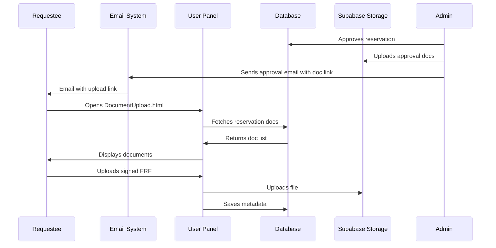

# Document Upload System - Implementation Plan

## Overview

This document outlines the implementation plan for a dual-document upload system where:
- **Requestees** can upload certain documents via a link in their approval email
- **Admins** can upload administrative documents (Approval, Venue Slip, Cash Invoice, Permit to Use Facility)
- All documents are visible in `Relevantdocuments.html` for both Admin and SuperAdmin panels

---

## System Architecture

```mermaid
flowchart TD
    subgraph External["Email System"]
        Email[Approval Email]
    end

    subgraph Admin["Admin/SuperAdmin Panel"]
        RD_Admin[Relevantdocuments.html]
        AdminUpload[Upload Documents]
        AD_Slip[AD_Slip.html]
    end

    subgraph User["User Panel"]
        UserDocPage[DocumentUpload.html]
        UserDashboard[Userdashboard.html]
    end

    subgraph Database["Supabase Database"]
        Reservations[reservations table]
        Users[users table]
        ReservationDocs[reservation_documents table]
    end

    subgraph Storage["Supabase Storage"]
        Bucket[facilityreservation bucket]
        Folder[Reserved Facilities/{request_id}/]
    end

    Email -->|"View Documents Link"| UserDocPage
    AdminUpload -->|"Upload Files"| Storage
    UserDocPage -->|"Upload Files"| Storage
    Storage -->|"Display Documents"| RD_Admin
    Storage -->|"Download Documents"| UserDocPage
    AdminUpload -->|"Save Metadata"| ReservationDocs
    UserDocPage -->|"Save Metadata"| ReservationDocs
    ReservationDocs -->|"Query Docs"| RD_Admin
    ReservationDocs -->|"Query Docs"| UserDocPage
```

---

## Document Types & Uploaders

| Document Type | Uploaded By | Purpose |
|--------------|-------------|---------|
| FRF (Facility Reservation Form) | Requestee | User's original reservation request |
| Signed Approval | Requestee | Signed approval document |
| Approval | Admin | Admin-generated approval letter |
| Venue Slip | Admin | Venue assignment confirmation |
| Cash Invoice | Admin | Payment invoice |
| Permit to Use Facility | Admin | Official permit |

---

## Database Changes

### New Table: `reservation_documents`

```sql
-- ===============================================
-- RESERVATION DOCUMENTS TABLE
-- For tracking uploaded documents per reservation
-- ===============================================

-- Create reservation_documents table
CREATE TABLE IF NOT EXISTS reservation_documents (
    id SERIAL PRIMARY KEY,
    request_id TEXT NOT NULL REFERENCES reservations(request_id) ON DELETE CASCADE,
    document_type TEXT NOT NULL CHECK (document_type IN (
        'frf', 
        'signed_approval', 
        'approval', 
        'venue_slip', 
        'cash_invoice', 
        'permit_to_use_facility'
    )),
    filename TEXT NOT NULL,
    file_url TEXT NOT NULL,
    file_size INTEGER,
    mime_type TEXT DEFAULT 'application/pdf',
    uploaded_by TEXT REFERENCES users(id),
    uploaded_by_role TEXT CHECK (uploaded_by_role IN ('faculty', 'student_organization', 'admin', 'super_admin')),
    created_at TIMESTAMP DEFAULT NOW()
);

-- ===============================================
-- INDEXES
-- ===============================================
CREATE INDEX IF NOT EXISTS idx_reservation_docs_request_id ON reservation_documents(request_id);
CREATE INDEX IF NOT EXISTS idx_reservation_docs_type ON reservation_documents(document_type);
CREATE INDEX IF NOT EXISTS idx_reservation_docs_uploaded_by ON reservation_documents(uploaded_by);

-- ===============================================
-- HELPER FUNCTION: Get documents for a reservation
-- ===============================================
CREATE OR REPLACE FUNCTION get_reservation_documents(p_request_id TEXT)
RETURNS TABLE(
    id INT,
    document_type TEXT,
    filename TEXT,
    file_url TEXT,
    file_size INT,
    mime_type TEXT,
    uploaded_by TEXT,
    uploaded_by_role TEXT,
    uploaded_by_name TEXT,
    created_at TIMESTAMP
) AS $$
BEGIN
    RETURN QUERY
    SELECT 
        rd.id,
        rd.document_type,
        rd.filename,
        rd.file_url,
        rd.file_size,
        rd.mime_type,
        rd.uploaded_by,
        rd.uploaded_by_role,
        CONCAT(u.first_name, ' ', u.last_name) AS uploaded_by_name,
        rd.created_at
    FROM reservation_documents rd
    LEFT JOIN users u ON rd.uploaded_by = u.id
    WHERE rd.request_id = p_request_id
    ORDER BY 
        CASE rd.document_type
            WHEN 'frf' THEN 1
            WHEN 'signed_approval' THEN 2
            WHEN 'approval' THEN 3
            WHEN 'venue_slip' THEN 4
            WHEN 'cash_invoice' THEN 5
            WHEN 'permit_to_use_facility' THEN 6
        END;
END;
$$ LANGUAGE plpgsql SECURITY DEFINER;

-- ===============================================
-- HELPER FUNCTION: Check if user owns reservation
-- ===============================================
CREATE OR REPLACE FUNCTION check_reservation_ownership(p_request_id TEXT, p_user_id TEXT)
RETURNS BOOLEAN AS $$
DECLARE
    is_owner BOOLEAN;
BEGIN
    SELECT EXISTS(
        SELECT 1 FROM reservations 
        WHERE request_id = p_request_id AND id = p_user_id
    ) INTO is_owner;
    
    RETURN COALESCE(is_owner, FALSE);
END;
$$ LANGUAGE plpgsql SECURITY DEFINER;

-- ===============================================
-- HELPER FUNCTION: Add document record
-- ===============================================
CREATE OR REPLACE FUNCTION add_reservation_document(
    p_request_id TEXT,
    p_document_type TEXT,
    p_filename TEXT,
    p_file_url TEXT,
    p_file_size INT,
    p_uploaded_by TEXT,
    p_uploaded_by_role TEXT
)
RETURNS TABLE(success BOOLEAN, message TEXT, doc_id INT) AS $$
DECLARE
    v_doc_id INT;
BEGIN
    -- Check if document type already exists for this reservation
    IF EXISTS(
        SELECT 1 FROM reservation_documents 
        WHERE request_id = p_request_id AND document_type = p_document_type
    ) THEN
        -- Update existing document
        UPDATE reservation_documents 
        SET 
            filename = p_filename,
            file_url = p_file_url,
            file_size = p_file_size,
            uploaded_by = p_uploaded_by,
            uploaded_by_role = p_uploaded_by_role,
            created_at = NOW()
        WHERE request_id = p_request_id AND document_type = p_document_type
        RETURNING id INTO v_doc_id;
        
        RETURN QUERY SELECT TRUE, 'Document updated successfully', v_doc_id;
    ELSE
        -- Insert new document
        INSERT INTO reservation_documents (
            request_id, document_type, filename, file_url, 
            file_size, uploaded_by, uploaded_by_role
        ) VALUES (
            p_request_id, p_document_type, p_filename, p_file_url,
            p_file_size, p_uploaded_by, p_uploaded_by_role
        )
        RETURNING id INTO v_doc_id;
        
        RETURN QUERY SELECT TRUE, 'Document uploaded successfully', v_doc_id;
    END IF;
END;
$$ LANGUAGE plpgsql SECURITY DEFINER;

-- ===============================================
-- HELPER FUNCTION: Delete document
-- ===============================================
CREATE OR REPLACE FUNCTION delete_reservation_document(p_doc_id INT, p_user_id TEXT)
RETURNS BOOLEAN AS $$
DECLARE
    v_deleted BOOLEAN := FALSE;
BEGIN
    -- Only allow deletion by the uploader or admin
    DELETE FROM reservation_documents 
    WHERE id = p_doc_id 
    AND (uploaded_by = p_user_id OR uploaded_by_role IN ('admin', 'super_admin'))
    RETURNING TRUE INTO v_deleted;
    
    RETURN COALESCE(v_deleted, FALSE);
END;
$$ LANGUAGE plpgsql SECURITY DEFINER;

-- ===============================================
-- GRANT PERMISSIONS
-- ===============================================
GRANT USAGE ON SEQUENCE reservation_documents_id_seq TO public;
GRANT SELECT, INSERT, UPDATE, DELETE ON reservation_documents TO public;
GRANT EXECUTE ON FUNCTION get_reservation_documents(TEXT) TO public;
GRANT EXECUTE ON FUNCTION check_reservation_ownership(TEXT, TEXT) TO public;
GRANT EXECUTE ON FUNCTION add_reservation_document(TEXT, TEXT, TEXT, TEXT, INT, TEXT, TEXT) TO public;
GRANT EXECUTE ON FUNCTION delete_reservation_document(INT, TEXT) TO public;

-- ===============================================
-- COMMENTS
-- ===============================================
COMMENT ON TABLE reservation_documents IS 'Stores uploaded documents for each reservation';
COMMENT ON FUNCTION get_reservation_documents IS 'Retrieves all documents for a specific reservation';
COMMENT ON FUNCTION check_reservation_ownership IS 'Verifies if a user owns a specific reservation';
COMMENT ON FUNCTION add_reservation_document IS 'Adds or updates a document record for a reservation';
COMMENT ON FUNCTION delete_reservation_document IS 'Deletes a document (only by uploader or admin)';

-- ===============================================
-- DOCUMENT TYPE LABELS (for UI display)
-- ===============================================
-- frf                      -> FRF
-- signed_approval           -> Signed Approval
-- approval                  -> Approval
-- venue_slip                -> Venue Slip
-- cash_invoice              -> Cash Invoice
-- permit_to_use_facility    -> Permit to Use Facility
```

---

## Storage Structure

```
facilityreservation bucket
└── Reserved Facilities/
    └── {request_id}/
        ├── frf.pdf
        ├── signed_approval.pdf
        ├── approval.pdf
        ├── venue_slip.pdf
        ├── cash_invoice.pdf
        └── permit_to_use_facility.pdf
```

---

## Implementation Tasks

### Phase 1: Database & Storage Setup

1. **SQL Migration Script**
   - Create `reservation_documents` table
   - Add indexes and permissions
   - File: `plans/create_reservation_documents_table.sql`

2. **Storage Policy Update**
   - Allow public uploads to `Reserved Facilities/{request_id}/`
   - Allow public reads for all files in bucket

### Phase 2: User Panel - Document Upload Page

3. **Create `User panel/DocumentUpload.html`**
   - Header with UDM branding
   - User info display
   - Reservation details summary
   - Document list with status indicators
   - Upload buttons for user documents (FRF, Signed Approval)
   - View/Download buttons for admin documents

4. **Create `User panel/Javascript/DocumentUpload.js`**
   - Load reservation details from URL params
   - Fetch and display all documents for reservation
   - Handle file uploads via Supabase Storage
   - Save document metadata to database
   - Show upload progress

5. **Create `User panel/CSS/DocumentUpload.css`**
   - Card-based document display
   - Upload button styling
   - Progress indicators
   - Print button

### Phase 3: Admin Panel - Document Management

6. **Modify `Relevantdocuments.html` (Admin)**
   - Add upload capability for admin documents
   - Dynamic document loading from database
   - Remove static placeholder content
   - File input for each document type

7. **Modify `Relevantdocuments.html` (SuperAdmin)**
   - Same changes as Admin version
   - Sync document display with Admin

8. **Create `Relevantdocuments.js` (shared logic)**
   - Load documents by request_id
   - Upload handling for each document type
   - File validation (PDF only, max 10MB)
   - Success/error notifications

### Phase 4: Email Integration

9. **Modify Email Templates**
   - Add "Upload Documents" link in approval email
   - Link format: `User panel/DocumentUpload.html?request_id={id}`
   - Add "View Documents" button for approved requests

10. **Update `sendEmail.js` (Admin)**
    - Include document upload link in approval email

11. **Update `sendEmail.js` (SuperAdmin)**
    - Same changes

---

## File Summary

| File | Action | Purpose |
|------|--------|---------|
| `plans/create_reservation_documents_table.sql` | Create | Database migration |
| `User panel/DocumentUpload.html` | Create | User document viewing/upload page |
| `User panel/Javascript/DocumentUpload.js` | Create | Client-side logic for user docs |
| `User panel/CSS/DocumentUpload.css` | Create | Styling for user doc page |
| `Admin panel/Admin-panel/Relevantdocuments.html` | Modify | Dynamic doc loading + admin upload |
| `Admin panel/Admin-panel/java/Relevantdocuments.js` | Create | Admin doc management logic |
| `SuperAdmin panel/SuperAdmin-panel/SA_Relevantdocuments.html` | Modify | Dynamic doc loading + admin upload |
| `SuperAdmin panel/SuperAdmin-panel/java/SA_Relevantdocuments.js` | Create | SuperAdmin doc management logic |
| `Admin panel/Admin-panel/java/sendEmail.js` | Modify | Add document link to email |
| `SuperAdmin panel/SuperAdmin-panel/java/sendEmail.js` | Modify | Add document link to email |
| `supabase-storage-policies.sql` | Modify | Update storage permissions |

---

## Security Considerations

1. **Authentication**: User can only view/upload documents for their own reservations
2. **File Validation**: Only PDF files allowed, max 10MB per file
3. **Path Traversal Prevention**: request_id validated against user's reservations
4. **RLS Policies**: Implement Row Level Security on `reservation_documents` table

---

## Mermaid: User Flow



---

## Next Steps

1. Review and approve this plan
2. Switch to Code mode to implement Phase 1 (Database & Storage)
3. Continue with subsequent phases