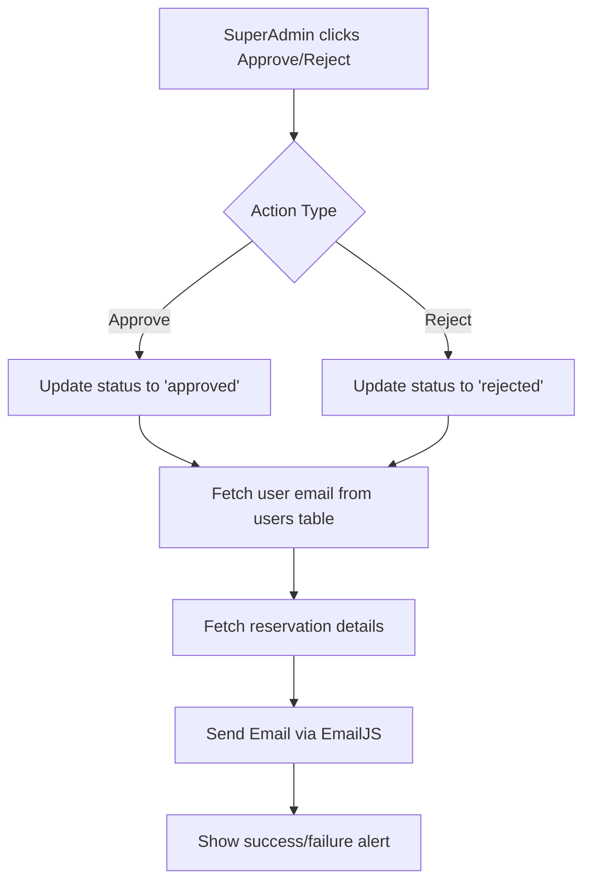

# SuperAdmin Email Notification Implementation Plan

## Overview
Add EmailJS functionality to send email notifications to users when a Super Admin approves or rejects their venue reservation request.

## Architecture



## Implementation Steps

### Step 1: Update SA_Slip.html
- Add EmailJS SDK script
- Add configuration for EmailJS credentials

### Step 2: Create email notification module
- File: `SuperAdmin panel/SuperAdmin-panel/java/SA_EmailNotification.js`
- Functions:
  - `sendApprovalEmail(userEmail, reservationDetails)` - Sends approval notification
  - `sendRejectionEmail(userEmail, reservationDetails)` - Sends rejection notification
  - `fetchUserEmail(userId)` - Fetches user email from database
  - `fetchReservationDetails(requestId)` - Fetches full reservation details

### Step 3: Modify SA_Pending.js
- Import the email notification module
- After successful approve action → call `sendApprovalEmail()`
- After successful reject action → call `sendRejectionEmail()`
- Add error handling for email failures

## Files to Modify

| File | Changes |
|------|---------|
| `SuperAdmin panel/SuperAdmin-panel/SA_Slip.html` | Add EmailJS SDK script |
| `SuperAdmin panel/SuperAdmin-panel/java/SA_EmailNotification.js` | New file - email sending logic |
| `SuperAdmin panel/SuperAdmin-panel/java/SA_Pending.js` | Add email sending on approve/reject |

## Email Template Variables

These variables will be passed to EmailJS templates:
- `user_name` - User's full name
- `user_email` - User's email address
- `request_id` - Reservation request ID
- `facility` - Reserved facility
- `event_date` - Date of event
- `time_start` - Start time
- `time_end` - End time
- `event_title` - Title of the event
- `unit_office` - Unit/Office/College

## Environment Variables to Add

Create a configuration file or add to existing:
```javascript
const EMAILJS_CONFIG = {
    publicKey: 'YOUR_PUBLIC_KEY',
    serviceId: 'YOUR_SERVICE_ID', 
    approvalTemplateId: 'YOUR_APPROVAL_TEMPLATE_ID',
    rejectionTemplateId: 'YOUR_REJECTION_TEMPLATE_ID'
};
```

## Error Handling

1. If email fails to send, still allow the approve/reject action to complete
2. Log email errors to console for debugging
3. Show user-friendly message if email fails

## Testing Checklist

- [ ] Test approval email is sent with correct details
- [ ] Test rejection email is sent with correct details
- [ ] Verify email contains all reservation information
- [ ] Test when user email is missing from database
- [ ] Test network failure scenarios