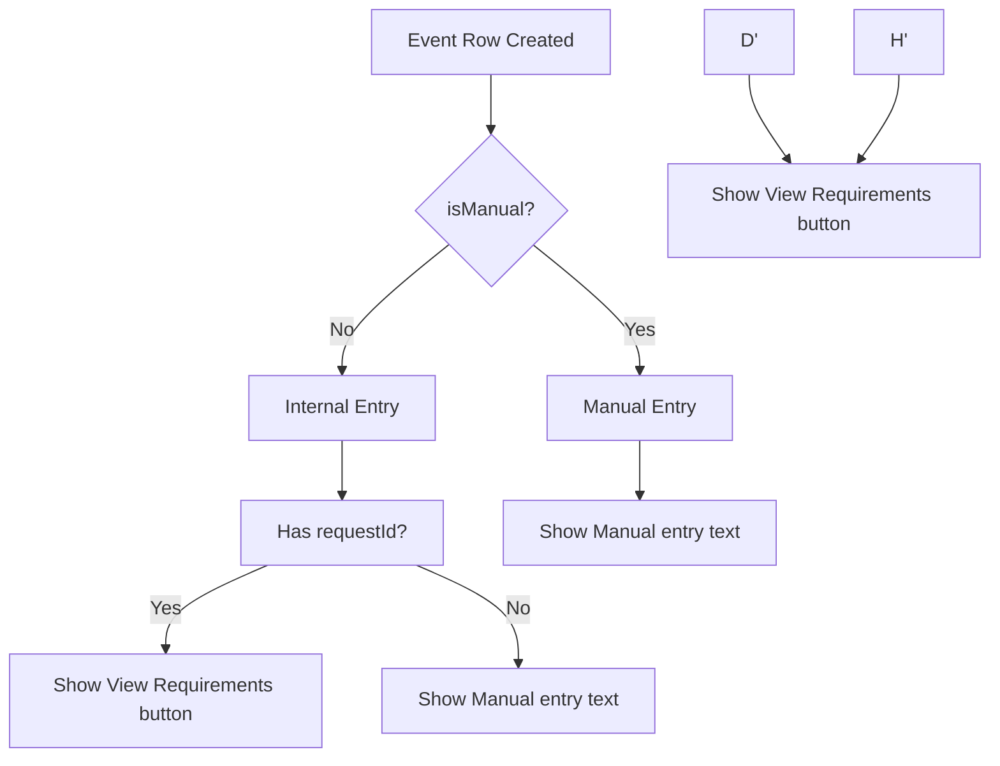

# View Requirements for Manual Entry - Implementation Plan

## Problem
Manual/External events in the facility table show "Manual entry" text instead of a "View Requirements" button like Internal/FRF events do.

### Current Behavior (Bug)
| Event Type | Action Column |
|------------|---------------|
| Internal (FRF) | `View Requirements` button |
| External (Manual) | `Manual entry` text |

### Desired Behavior
All events should have a "View Requirements" button that opens a modal to view/edit requirements.

---

## Implementation Steps

### Step 1: Add `requirements` column to `manual_events` table

**File:** `scripts/add_requirements_to_manual_events.sql`

```sql
-- Add requirements column to manual_events table
ALTER TABLE manual_events 
ADD COLUMN IF NOT EXISTS requirements TEXT;

-- Grant permissions
GRANT ALL ON manual_events TO public;
```

### Step 2: Update Admin panel UDMfacility_new.js

**File:** `Admin panel/Admin-panel/java/UDMfacility_new.js`

**Changes:**
1. Update row generation logic (lines 291-312) to show "View Requirements" button for ALL entries (not just `!entry.isManual`)
2. Pass the `requirements` field to the entry object when fetching manual events
3. Add click handler to open a modal with requirements

**Key Code Change:**
```javascript
// OLD (line 291):
if (!entry.isManual && entry.requestId) {

// NEW:
if (entry.requestId || entry.isManual) {
```

### Step 3: Create modal for viewing/editing manual event requirements

**File:** `Admin panel/Admin-panel/java/UDMfacility_new.js`

Add a modal function:
```javascript
function openManualEventRequirementsModal(entry) {
  // Show modal with requirements textarea
  // Save button updates requirements via Supabase
}
```

### Step 4: Update SuperAdmin panel UDMfacility.js

**File:** `SuperAdmin panel/SuperAdmin-panel/java/UDMfacility.js`

Same changes as Step 2 & 3 for SuperAdmin panel.

---

## Files to Modify
1. `scripts/add_requirements_to_manual_events.sql` (create)
2. `Admin panel/Admin-panel/java/UDMfacility_new.js` (modify)
3. `SuperAdmin panel/SuperAdmin-panel/java/UDMfacility.js` (modify)

---

## Mermaid Diagram: Current vs Proposed Flow


